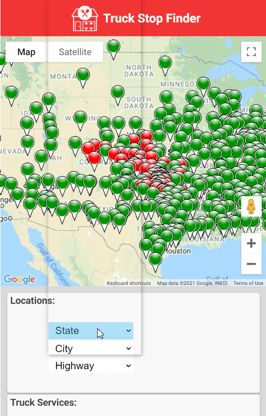

# Truck Stop Finder MVP App

(This app was created as part of a team project at the Code Chrysalis Bootcamp.)



### Front End

The front end consists of a responsive React web app that allows truck drivers to search for FlyingK truck stops in the US.

Users are able to select a state, city and/or highway and display a list of truck stops and also markers on the map.

Users can also filter results by features such as Stop Type, Facilities, Restaurants, etc..

The app is deployed on heroku at [truck-stop-searcher.herokuapp.com](http://truck-stop-searcher.herokuapp.com) using a CI/CD pipeline.

### Back End

The back end consists of a Postgres database deployed on Heroku which uses a REST API and Knex to respond to queries from the front end app.

---

## Installation

Clone the app from github and (on node) run `npm install` to install the required dependencies.

If you wish to use heroku to deploy your database then create a heroku pipeline with apps and connect it to your github repo. Provision a postgres database on your herou app.

Create a `.env` file in the root directory of the project and add a path to your database:

```
DATABASE_URL=postgres://...
```

Note, you may need to set `PGSSLMODE=no-verify` in your `.env` file to access the database.

### Back end scripts

You may wish to run these in a separate terminal from the back end scripts during development:

`npm run migrate migration_name` runs knex migrations

`npm start` starts the backend server and seeds migrations

### Front end scripts

You may wish to run these in a separate terminal from the front end during development:

`npm run hack` starts the front end server in watch mode for easy development

`npm run build` builds the front end

---

## REST API

The API provides the following endpoints:

- `/api/filter/:state/:city` returns a filtered list of truck stops by state and optional city or highway (use '-' if the value should be empty )
- `/api/amenities` returns a list of all amenities
- `/api/truck-services` returns a list of all services
- `/api/restaurants` returns a list of all restaurants
